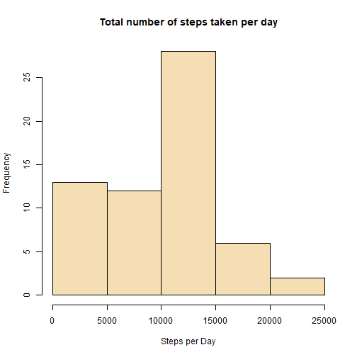
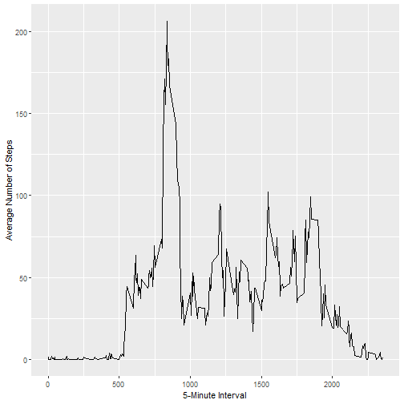
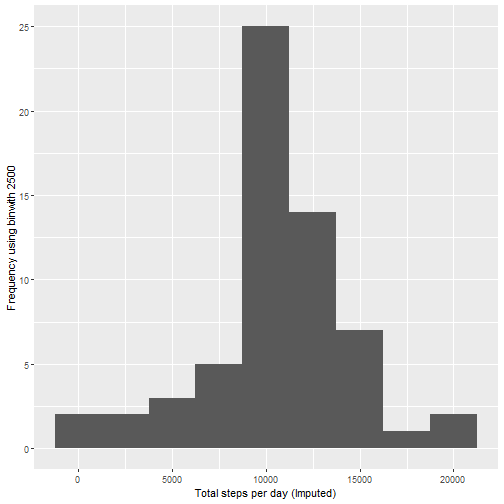
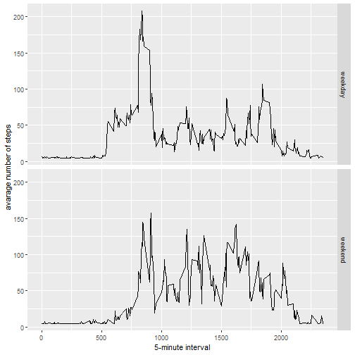

# Reproducible Research: Peer Assessment 1


## Loading and preprocessing the data
##### 1. Load the data (i.e. read.csv())

```r
if(!file.exists("activity.csv")) {
        tempfile <- tempfile()
        download.file("http://d396qusza40orc.cloudfront.net/repdata%2Fdata%2Factivity.zip",destfile = tempfile)
        unzip(tempfile)
        unlink(tempfile)
}
#load data
activity_data <- read.csv("activity.csv")
```
######Inspecting the data sets:

```r
summary(activity_data)
```

```
##      steps                date          interval     
##  Min.   :  0.00   2012-10-01:  288   Min.   :   0.0  
##  1st Qu.:  0.00   2012-10-02:  288   1st Qu.: 588.8  
##  Median :  0.00   2012-10-03:  288   Median :1177.5  
##  Mean   : 37.38   2012-10-04:  288   Mean   :1177.5  
##  3rd Qu.: 12.00   2012-10-05:  288   3rd Qu.:1766.2  
##  Max.   :806.00   2012-10-06:  288   Max.   :2355.0  
##  NA's   :2304     (Other)   :15840
```
##### 2. Process/transform the data (if necessary) into a format suitable for your analysis

```r
activity_data$date <- as.POSIXct(activity_data$date, format="%Y-%m-%d")

# Compute the weekdays from the date attribute
activity_data <- data.frame(date=activity_data$date, 
                           weekday=tolower(weekdays(activity_data$date)), 
                           steps=activity_data$steps, 
                           interval=activity_data$interval)

# Compute the day type (weekend or weekday)
activity_data <- cbind(activity_data, 
                      daytype=ifelse(activity_data$weekday == "saturday" | 
                                     activity_data$weekday == "sunday", "weekend", 
                                     "weekday"))

# Create the final data.frame
activity <- data.frame(date=activity_data$date, 
                       weekday=activity_data$weekday, 
                       daytype=activity_data$daytype, 
                       interval=activity_data$interval,
                       steps=activity_data$steps)
```

#####Checking the transformed data

```r
summary(activity)
```

```
##       date                 weekday        daytype         interval     
##  Min.   :2012-10-01   friday   :2592   weekday:12960   Min.   :   0.0  
##  1st Qu.:2012-10-16   monday   :2592   weekend: 4608   1st Qu.: 588.8  
##  Median :2012-10-31   saturday :2304                   Median :1177.5  
##  Mean   :2012-10-31   sunday   :2304                   Mean   :1177.5  
##  3rd Qu.:2012-11-15   thursday :2592                   3rd Qu.:1766.2  
##  Max.   :2012-11-30   tuesday  :2592                   Max.   :2355.0  
##                       wednesday:2592                                   
##      steps       
##  Min.   :  0.00  
##  1st Qu.:  0.00  
##  Median :  0.00  
##  Mean   : 37.38  
##  3rd Qu.: 12.00  
##  Max.   :806.00  
##  NA's   :2304
```

-----

## What is mean total number of steps taken per day?

```r
stepsByDay <- tapply(activity$steps, activity$date, sum, na.rm=TRUE)
```

##### 1. Make a histogram of the total number of steps taken each day

```r
hist(stepsByDay, xlab = "Steps per Day", main = "Total number of steps taken per day", col = "wheat")
```



##### 2. Calculate and report the mean and median total number of steps taken per day

```r
stepsByDayMean <- mean(stepsByDay)
stepsByDayMedian <- median(stepsByDay)
```
* The Mean is 9354.2295082
* The Median is 10395

-----

## What is the average daily activity pattern?

```r
average_steps_time_block <- aggregate(x=list(meanSteps=activity_data$steps), by=list(interval=activity_data$interval), FUN=mean, na.rm=TRUE)
```

##### 1. Make a time series plot

```r
ggplot(data=average_steps_time_block, aes(x=interval, y=meanSteps)) +
    geom_line() +
    xlab("5-Minute Interval") +
    ylab("Average Number of Steps") 
```



##### 2. Which 5-minute interval, on average across all the days in the dataset, contains the maximum number of steps?

```r
mostSteps <- which.max(average_steps_time_block$meanSteps)
timeMostSteps <-  gsub("([0-9]{1,2})([0-9]{2})", "\\1:\\2", average_steps_time_block[mostSteps,'interval'])
```

* The 5-minute interval with the most steps is 8:35

----

## Imputing missing values
##### 1. Calculate and report the total number of missing values in the dataset 

```r
numMissingValues <- length(which(is.na(activity_data$steps)))
```

* The Number of missing values is 2304

##### 2. Devise a strategy for filling in all of the missing values in the dataset.

```r
imputedactivitydata <- activity_data
imputedactivitydata$steps[is.na(imputedactivitydata$steps)] <- mean(imputedactivitydata$steps,na.rm=TRUE)
imputedactivitydata$steps <- as.numeric(imputedactivitydata$steps)
imputedactivitydata$interval <- as.numeric(imputedactivitydata$interval)
colSums(is.na(imputedactivitydata))
```

```
##     date  weekday    steps interval  daytype 
##        0        0        0        0        0
```
##### 3. Create a new dataset that is equal to the original dataset but with the missing data filled in.

```r
summary(imputedactivitydata)
```

```
##       date                 weekday         steps           interval     
##  Min.   :2012-10-01   friday   :2592   Min.   :  0.00   Min.   :   0.0  
##  1st Qu.:2012-10-16   monday   :2592   1st Qu.:  0.00   1st Qu.: 588.8  
##  Median :2012-10-31   saturday :2304   Median :  0.00   Median :1177.5  
##  Mean   :2012-10-31   sunday   :2304   Mean   : 37.38   Mean   :1177.5  
##  3rd Qu.:2012-11-15   thursday :2592   3rd Qu.: 37.38   3rd Qu.:1766.2  
##  Max.   :2012-11-30   tuesday  :2592   Max.   :806.00   Max.   :2355.0  
##                       wednesday:2592                                    
##     daytype     
##  weekday:12960  
##  weekend: 4608  
##                 
##                 
##                 
##                 
## 
```


##### 4. Make a histogram of the total number of steps taken each day 

```r
stepsByDayImputed <- tapply(imputedactivitydata$steps, imputedactivitydata$date, sum)
qplot(stepsByDayImputed, xlab='Total steps per day (Imputed)', ylab='Frequency using binwith 2500', binwidth=2500)
```



##### ... and Calculate and report the mean and median total number of steps taken per day. 

```r
stepsByDayMeanImputed <- as.integer(mean(stepsByDayImputed))
stepsByDayMedianImputed <- as.integer(median(stepsByDayImputed))
```
* The Imputed Mean and Median are 10766 and 10766 resoectively.


----

## Are there differences in activity patterns between weekdays and weekends?
##### 1. Create a new factor variable in the dataset with two levels - "weekday" and "weekend" indicating whether a given date is a weekday or weekend day.


```r
imputedactivitydata$dateType <-  ifelse(as.POSIXlt(imputedactivitydata$date)$wday %in% c(0,6), 'weekend', 'weekday')
```

##### 2. Make a panel plot containing a time series plot


```r
averagedactivity <- aggregate(steps ~ interval + dateType, data=imputedactivitydata, mean)
ggplot(averagedactivity, aes(interval, steps)) + 
    geom_line() + 
    facet_grid(dateType ~ .) +
    xlab("5-minute interval") + 
    ylab("avarage number of steps")
```


